# 实验1
## Part1

为了熟悉基础操作，首先进行了以下操作：
1. 用`ls`命令查看当前目录下的文件
2. 用`cd`命令进入到`/Desktop`目录
3. 用`mkdir`命令在`/Desktop`目录下创建了一个名为`/exercise`的文件夹，用于存放实验文件。并再新建一个文件夹`/e1`，存放实验1的文件。进入`/e1`文件夹。并再新建目录`/paht1`
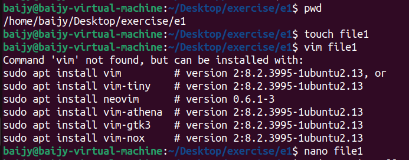
4. 用`pwd`命令，查看当前目录的绝对路径。
5. 用`touch`命令创建了一个名为`file1`的文件。
6. 用`vim`命令，进入`file1`文件，发现本地未安装`vim`。
7. 用`nano`命令，进入`file1`文件，编辑了一些文字。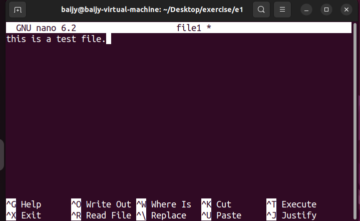，随后保存并退出。
8. 用`sodu apt install vim`命令，安装了`vim`。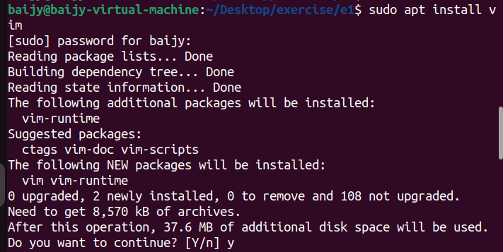，重新用`vim`打开`file1`文件，增加一行并保存退出。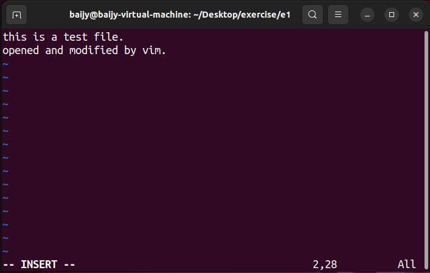
9. 用`cp` 命令，将`file1`文件复制到此文件并命名为`file2`.
10. 用`rm`命令，删除`file2`文件。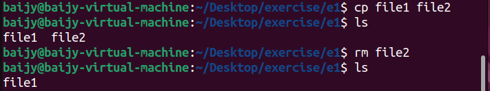
11. 用`mv`命令，将`file1`文件移动到`/path1`目录下,并用`mv`进行重命名为`file`。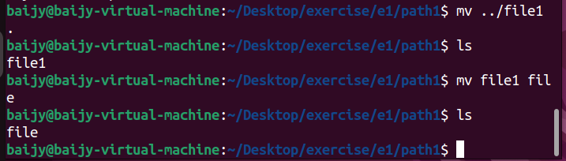
为了测试文件查看命令，将课堂笔记复制到虚拟机中并打开查看。
12. 用`cat`命令直接查看整个文件，并用`-n`参数查看行号。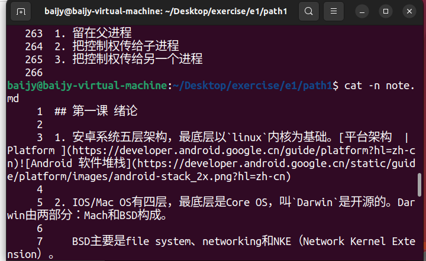
13. 用`more`命令，查看文件的前5行。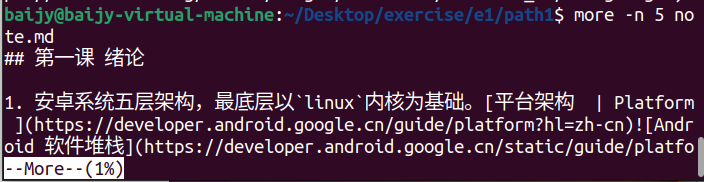
14. 用`less`命令，查看文件末尾。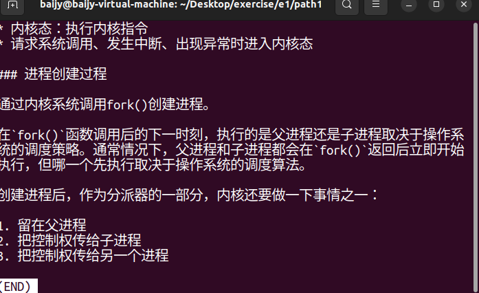
15. 用`grep`命令，查找文件中的`fork`关键字。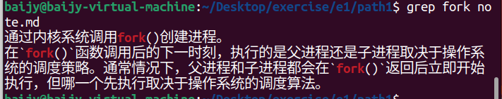
16. 用`man man `查看`man`命令的帮助文档。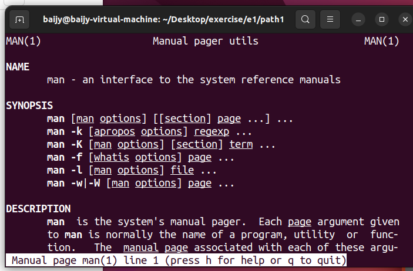
17. 用`rmdir`命令，删除目录。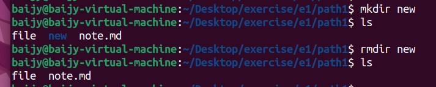
18. 用`ps`命令，查看当前进程状态。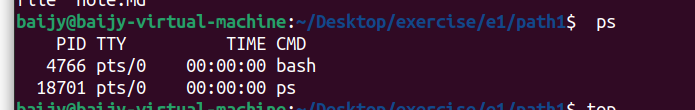
19. 用`top`命令，查看系统资源使用情况。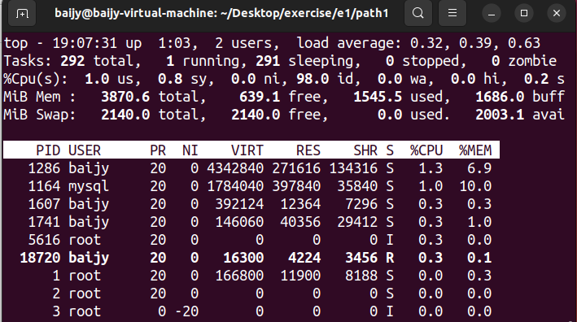
20. 用`history`命令查看历史命令。通过加参数，可以查看最近5行。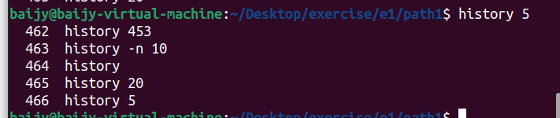
21. 用`!行号`，可以执行具体的历史命令。
22. 用`df`命令，查看磁盘使用情况。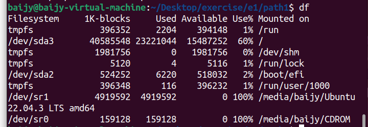

## Part2
写简单的`helloworld`脚本.
```shell
#!/bin/bash
echo "Hello World"
```
给予可执行权限后运行。
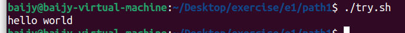
随后进行了一些别的shell语句尝试：
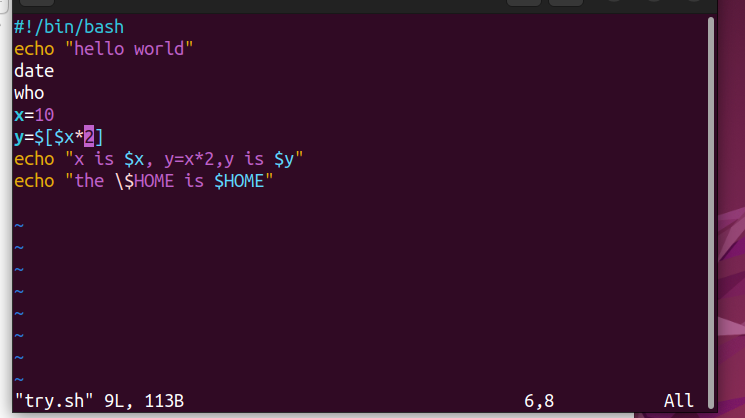
输出如下：
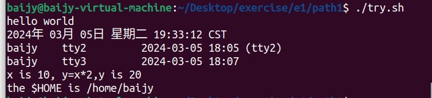
 