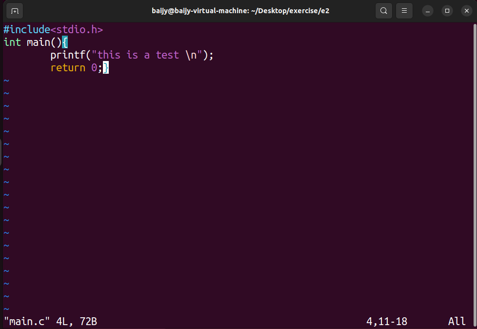

## 实验二
### Part1 GCC使用
首先用vim，编写了一个简单的C程序：

进行了GCC的各种使用：
1. `GCC -E：`进行预处理，将源文件转换为.i文件：
   
2. `GCC -S：`进行编译，将源文件转换为汇编文件：
   
3. 以及`-c，-o，-g`等选项的使用:
   
### Part2 makefile的编写
主函数`test.c`:

`power.h`:

`power.c`:


```Makefile
# 定义编译器和编译选项
CC = gcc
CFLAGS = -g -Wall

# 定义目标文件和可执行文件
TARGET = myprogram
OBJS = test.o power.o

# 默认目标（第一个目标）为可执行文件
all: $(TARGET)

# 生成可执行文件的规则
$(TARGET): $(OBJS)
	$(CC) $(CFLAGS) -o $(TARGET) $(OBJS)

# 生成目标文件的规则
test.o: test.c power.h
	$(CC) $(CFLAGS) -c test.c -o test.o

power.o: power.c power.h
	$(CC) $(CFLAGS) -c power.c -o power.o

# 清理规则
clean:
	rm -f $(OBJS) $(TARGET)
```
输出结果：
