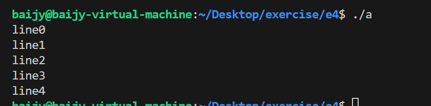
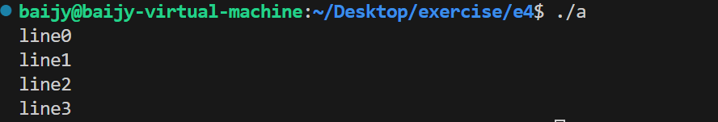
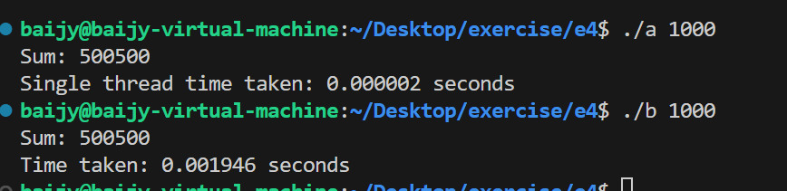
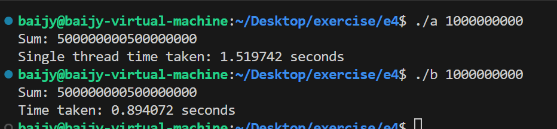

## Part Ⅰ
### 无参数情况
根据线程创建示例直接写c程序如下：
```c
#include<pthread.h>
#include<stdio.h>
#include<stdlib.h>
#include<unistd.h>
void *thread_function(void *arg){
    for(int p=0;p<5;p++){
        printf("line%d\n",p);
    }
    return NULL;
}
int p=20;
int main(){
    pthread_t my_thread;
    if(pthread_create(&my_thread,NULL,thread_function,NULL)){
        printf("erro");
        abort();
    }
    if(pthread_join(my_thread,NULL)){
        printf("error join");
        abort();
    }
    exit(0);
}
```
就是一个很简单的输出5行，运行结果如下：

### 简单参数
随后修改为传入一个int参数，需要在函数中根据地址进行参数强制类型转化。代码仅作以下修改：
```cpp
void *thread_function(void *arg){
    int *lim=(int *)arg;
    for(int p=0;p<*lim;p++){
        printf("line%d\n",p);
    }
    return NULL;
}
//主函数中传参：
int p=4;
    if(pthread_create(&my_thread,NULL,thread_function,(void *)&p))
```
输出结果：

这里，将p定义为全局变量与局部变量，在传递参数时好像并没有什么区别。
### 传入结构体
首先，定义结构体如下：
```CPP
struct homework{
    char name[100];
    char id[30];
    int time;
};
```
为了验证一下强制转换和结构体的存储方式，写一个简单的程序：
```cpp
void *thread_function(void *arg){
    int *lim=(int *)arg;
    printf("%x",*lim);
    return NULL;
}
homework p;
p.name[0]=5;
p.name[1]=0;
p.name[2]=0;
p.name[3]=0;
```
输出为5，验证了一下本地为小端存储，且结构体存储确实是按照顺序存储的。
接下来，传入结构,整体代码如下：
```cpp
#include<pthread.h>
#include<stdio.h>
#include<stdlib.h>
#include<unistd.h>
#include<string.h>
struct homework{
    char name[100];
    char id[30];
    int time;
};
void *thread_function(void *arg){
    homework *hm=(homework *)arg;
    printf("class name: %s \n",hm->name);
    printf("student id: %s \n",hm->id);
    printf("the %dth homework\n",hm->time);
    return NULL;
}
int main(){
    pthread_t my_thread;
    homework p;
    strcpy(p.id,"2022201538");
    strcpy(p.name,"operation system");
    p.time=4;
    if(pthread_create(&my_thread,NULL,thread_function,(void *)&p))
    {
        printf("erro");
        abort();
    }
    if(pthread_join(my_thread,NULL)){
        printf("error join");
        abort();
    }
    exit(0);
}
```
输出结果如下：


## Part Ⅱ

输出结果比较：
n=1000时：

其中b使用了多线程。
多线程更慢的原因是因为线程的创建和销毁需要时间，而且线程之间的切换也需要时间，所以在任务较为简单的情况下，多线程并不一定能够提高效率。
n=1000000000时：


当数据较大时，多线程的优势就体现出来了，这里b的运行时间远远小于a的运行时间。
单线程代码：
```CPP
#include <stdio.h>
#include <stdlib.h>
#include <pthread.h>
#include <sys/time.h>

int main(int argc, char *argv[]) {
    long long n = atoll(argv[1]);
    struct timeval start_time, end_time;
    gettimeofday(&start_time, NULL);
	long long sum=0;
    for(long long i=1;i<=n;i++){
sum+=i;}
    gettimeofday(&end_time, NULL);
    double elapsed_time = (end_time.tv_sec - start_time.tv_sec) + (end_time.tv_usec - start_time.tv_usec) / 1e6;
    printf("Sum: %lld\n", sum);
    printf("Time taken: %f seconds\n", elapsed_time);

    return 0;
}
```
多线程代码：
```CPP
#include <stdio.h>
#include <stdlib.h>
#include <pthread.h>
#include <sys/time.h>
#define ll long long
#define sz 2
//虚拟机只有2个核，所以size就设置了2.
ll sum=0;
void* function(void* arg){
    ll *low=(long long*)arg;
    ll *high=(long long*)arg+1;
    ll sum_now=0;
    for(ll i=*low;i<=*high;i++){
        sum_now+=i;
    }
    sum+=sum_now;
    pthread_exit(0);
}
int main(int arc,char *argv[]){
    ll n=atoll(argv[1]);
    pthread_t threads[sz];
    struct timeval start_time, end_time;
    gettimeofday(&start_time, NULL);
    ll pram[sz][2];
    for(ll i=0;i<sz;i++){
        pram[i][0]=1+i*n/sz;
        pram[i][1]=(i!=sz-1)?(i+1)*n/sz:n;}
    for(ll i=0;i<sz;i++){
        pthread_create(&threads[i],NULL,function,&pram[i]);
    }
    for (int i = 0; i < sz; ++i) {
        pthread_join(threads[i], NULL);
    }
    gettimeofday(&end_time, NULL);
    double elapsed_time = (end_time.tv_sec - start_time.tv_sec) + (end_time.tv_usec - start_time.tv_usec) / 1e6;
    printf("Sum: %lld\n", sum);
    printf("Time taken: %f seconds\n", elapsed_time);
    return 0;
}
```

