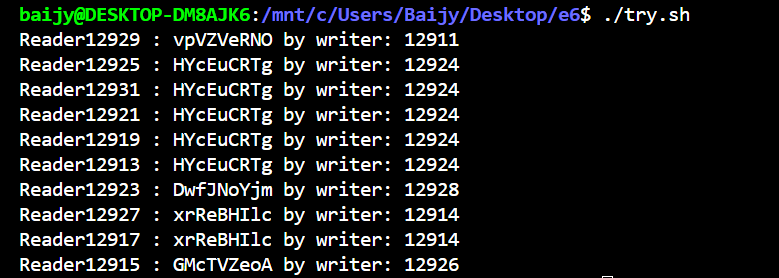

## Part Ⅰ通过共享内存实现进程间通信
### 方法思路
通过共享内存的方式进行进程间通信，需要开辟一个共同的内存空间，然后通过读写这个内存空间来实现进程间通信。
为了便于控制和调试，我将读写进程写为两个c程序，并通过bash脚本来启动。
### 实现步骤
由于需要实现多个读写进程，且读写进程需要互斥，读进程之间也要互斥，所以共享内存除了传递消息外，还需要传递信号量。
于是参照书上的伪代码进行实现，是一个读者优先的模型。
选择通过三个信号量来实现，两个二值信号量，一个计数信号量。
两个二值信号量，一个用于读写进程和读者进程间的互斥，一个用于读者进程间互斥访问计数信号量。
在写进程操作中，由于通过bash后台启动的进程不会阻塞读取控制台的输入，所以通过生成随机字符串的方式来模拟进程。
此外，由于多个进程都需要使用相同的共享内存，所以最终进程结束后又写了一个辅助程序，用于删除共享内存。
基于此，实现了一个共享内存的读写进程通信模型。
### 实现结果

同时开启了一堆写进程和读进程，可以看到进程们是并发的。
### 经验
有一个很重要的问题是最开始运行了之后会忘记关闭共享内存，导致共享内存一直存在，之后再次访问信号量时可能导致阻塞。
于是在最后写了一个辅助程序，用于删除共享内存。
## Part Ⅱ通过消息队列实现进程间通信
### 方法思路
用一个消息队列，实现多个进程之间互相的通信。
进程会向消息队列发送一个随机字符串，然后再从消息队列中读取一个字符串。
通过bash脚本进行辅助，启动多个进程，并在最后删除消息队列。
由于每个进程都要发送然后获取消息，所以用了一个sleep来确保进程可以随机收到消息。
### 实现结果

