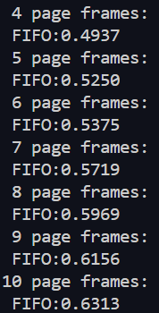

## 实验报告: 使用FIFO算法计算页面访问命中率

### 1. 实验目的

本实验旨在通过随机数产生指令序列，并将其转换为页面序列，计算不同页面置换算法（FIFO）在不同内存容量下的访问命中率。


### 2. 实验环境

- 编程语言：C
- 操作系统：Linux
- 开发工具：GCC

### 3. 实验步骤

#### 3.1 随机数产生指令序列

```c
int i, s;
int a[TOTAL_INSTRUCTIONS];
srand(10 * getpid());

s = (float)319 * rand() / 32767 / 32767 / 2 + 1;

for (i = 0; i < TOTAL_INSTRUCTIONS; i += 4) {
    if (s < 0 || s > 319) {
        printf("when i==%d, Error, s==%d\n", i, s);
        exit(0);
    }
    a[i] = s;
    a[i+1] = a[i] + 1;
    a[i+2] = (float)a[i] * rand() / 32767 / 32767 / 2;
    a[i+3] = a[i+2] + 1;
    s = (float)(318 - a[i+2]) * rand() / 32767 / 32767 / 2 + a[i+2] + 2;
    if ((a[i+2] > 318) || (s > 319))
        printf("a[%d+2],a number which is: %d and s==%d\n", i, a[i+2], s);
}
```

#### 3.2 指令序列转换成页面序列

假设页面大小为1KB，用户内存容量为4~32页，虚存容量为32KB。每页存放10条指令，320条指令将存放在32个页面中。

```c
#define PAGE_SIZE 10
#define TOTAL_PAGES (TOTAL_INSTRUCTIONS / PAGE_SIZE)

int instruction_to_page(int instruction) {
    return instruction / PAGE_SIZE;
}
```

#### 3.3 使用FIFO算法计算页面访问命中率

```c
#include <stdbool.h>

int fifo(int *pages, int num_pages, int num_frames) {
    int page_faults = 0;
    int frame[num_frames];
    int index = 0;
    bool page_found;

    for (int i = 0; i < num_frames; i++) {
        frame[i] = -1;
    }

    for (int i = 0; i < num_pages; i++) {
        page_found = false;
        for (int j = 0; j < num_frames; j++) {
            if (frame[j] == pages[i]) {
                page_found = true;
                break;
            }
        }
        if (!page_found) {
            frame[index] = pages[i];
            index = (index + 1) % num_frames;
            page_faults++;
        }
    }
    return page_faults;
}

```

#### 3.4主程序：

```cpp
int main() {
    int pages[TOTAL_PAGES];
    for (int i = 0; i < TOTAL_INSTRUCTIONS; i++) {
        pages[i / PAGE_SIZE] = instruction_to_page(a[i]);
    }
    for (int num_frames = 4; num_frames <= 32; num_frames++) {
        int page_faults = fifo(pages, TOTAL_PAGES, num_frames);
        float hit_rate = (TOTAL_PAGES - page_faults) / (float)TOTAL_PAGES;
        printf("Frames: %d, Page Faults: %d, Hit Rate: %.2f%%\n", num_frames, page_faults, hit_rate * 100);
    }
    return 0;
}
```


### 4. 实验结果
可以看到，随着内存页数的增加，页面访问命中率逐步提高。

但当页数较多时，上升可能就没那么明显了：

最终当32个页全部放入内存时，命中率达到了90%，那10%的缺页率是初始调入页面时带来的。

### 5. 实验分析

从实验结果可以看出，随着内存页数的增加，页面访问命中率显著提高。这是因为较多的内存页数可以容纳更多的页面，减少了页面替换的次数。

### 6. 结论

FIFO算法简单易实现，命中率受到内存容量的影响较大。
