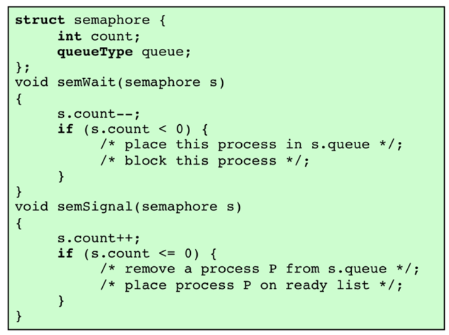

## 第一课 绪论

1. 安卓系统五层架构，最底层以`linux`内核为基础。[平台架构  | Platform ](https://developer.android.google.cn/guide/platform?hl=zh-cn)

2. IOS/Mac OS有四层，最底层是Core OS，叫`Darwin`是开源的。Darwin由两部分：Mach和BSD构成。

   BSD主要是file system、networking和NKE（Network Kernel Extension）。

   [Mac OS X ](https://etutorials.org/Mac+OS/using+mac+os+x+v10.3+panther/Part+I+Mac+OS+X+Exploring+the+Core/Chapter+1.+Mac+OS+X+Foundations/Mac+OS+X+Architecture+and+Terminology/)

3. `BSD`：Berkeley Software Distribution，与`Linux`同来自Unix。

4. Android和Apple操作系统内核有共同来源：Unix系统。1969年发布，最初版用汇编写的，此后为了便于开发，作者又搞出来了C语言。[The UNIX System -- History and Timeline -- UNIX History](https://unix.org/what_is_unix/history_timeline.html)

5. windows最底层为硬件抽象层（HAL），然后是内核层。

5. 也就是，ios，android，linux的内核都是由unix发展而来。

6. 408主要考内核部分，也是各个的相同点。

8. 操作系统主要功能：支撑应用程序的运行。

**本节课核心：操作系统发展脉络，主要用途。回顾一下冯诺依曼体系结构。**

### 补充：

#### 冯诺依曼体系结构

三个原则与五个部分：即采用[二进制](https://baike.baidu.com/item/二进制/361457?fromModule=lemma_inlink)逻辑、程序存储执行以及计算机由五个部分组成（[运算器](https://baike.baidu.com/item/运算器/2667320?fromModule=lemma_inlink)、控制器、[存储器](https://baike.baidu.com/item/存储器/1583185?fromModule=lemma_inlink)、[输入设备](https://baike.baidu.com/item/输入设备/10823368?fromModule=lemma_inlink)、[输出设备](https://baike.baidu.com/item/输出设备/10823333?fromModule=lemma_inlink)）


发展脉络：

1. **无操作系统时期：（串行处理）**
   - 在早期计算机时代，计算机是以硬件为中心的。程序员需要直接管理硬件资源，编写程序时必须考虑到硬件细节。
   - 每个程序都需要独占计算机的全部资源，因此效率较低，且难以实现多任务处理。

2. **批处理系统：**
   - 分为简单批处理和多道批处理。
   - 随着计算机的发展，人们意识到可以通过批处理系统来提高计算机的利用率。
   - 批处理系统允许将一批作业按顺序提交到计算机，由操作系统负责按照一定的顺序执行。
   - 典型的批处理系统包括IBM的OS/360。
   - 付出的代价是为了区别不同作业，需要加上标记（比如标记程序起始位置）
   - 于是加了一个控制语言（job control language）。意味着要在计算机中增加一个监督程序（monitor）来在计算机中处理标记（操作系统原型）。
   
3. **分时系统：**
   - 随着计算机用户的增多，分时系统成为必然选择。分时系统允许多个用户通过终端同时访问计算机系统。
   - 操作系统需要能够快速地在不同用户之间切换任务，确保每个用户都能够获得合理的响应时间。
   - 需要有时钟来标记时间片到了。每过一个时间片，就会发一个**硬件的时钟中断**。cpu每做一个操作都会去检测是否有中断信号。
   - Unix操作系统是早期成功的分时系统代表。第一个分时系统是ctss。
   
4. **个人计算机时代：**
   - 随着个人计算机的普及，操作系统的重点逐渐从多用户共享转向了个人使用。
   - MS-DOS是早期个人计算机的主要操作系统，但后来被Windows所取代。
   - Windows和Mac OS等图形用户界面操作系统使得个人计算机更加易用。

5. **网络操作系统：**
   - 随着计算机网络的普及，操作系统需要能够支持网络通信。
   - 网络操作系统能够管理分布在不同地点的计算机资源，支持远程访问和文件共享等功能。
   - Unix/Linux系统在网络操作系统领域具有很强的地位。

6. **移动操作系统：**
   - 随着智能手机和平板电脑的兴起，移动操作系统成为了重要的发展方向。
   - Android和iOS等操作系统专门针对移动设备设计，提供了触摸屏幕、移动应用等特定功能。

7. **实时操作系统：**
   - 对于需要及时响应的应用领域，如航空航天、工业控制等，实时操作系统变得至关重要。
   - 实时操作系统能够保证在规定的时间内完成任务，并提供精确的响应时间保证。

总的来说，操作系统的发展历程体现了不断解决计算机系统面临的各种挑战的过程，推动了计算机技术的不断进步和应用领域的拓展。

## 第二课 

1. 多角度看待操作系统：
   1. 普通用户
   2. 系统管理员
   3. 应用程序开发者
   4. 操作系统开发者
2. 冯诺依曼体系结构中，总线3条，最上层是地址总线。（数据、地址、控制三条）
3. 有一个记录cpu状态的寄存器，是硬件的状态，不由操作系统来控制。
4. cpu执行指令靠的是给出的内存地址。
5. 单道程序设计和多道程序设计。作业控制语言是为了多道程序设计而出现的。
6. 无操作系统时期，内存中只有一个程序。有操作系统后，内存中有两类程序，操作系统和应用程序。为了实现对操作系统的保护。需要区分操作形态：
   1. 通过硬件设定，将操作系统放在特定的内存区域。设置了用户态和内核态来区分。其具体由那个记录cpu状态的寄存器来决定。
   2. 用户态：
      1. 程序在用户态执行。
      2. 某些内存区域不允许访问。
      3. 某些指令不允许执行
   3. 内核态：
      1. 监督程序在内核态执行
      2. 可以执行特权指令
      3. 可以访问受保护的内存区域。（也就是读写可以在所有内存区域进行）
   4. 开机时计算机处于内核态。在内核态状态下，其中的程序可以执行指令改为用户态。但反之不行，不能通过指令来改回内核态。想从用户态回到内核态，只能通过硬件的中断处理，来回到内核态，执行操作系统程序。（updated第三课：也可以通过硬件执行特殊指令（比如系统中断）来实现）
   5. 本质上，内核态和用户态是一个硬件机制。
7. **进程**的概念很重要,进程状态包括运行态、就绪态、阻塞态等。

## 第三课

### 进程描述与控制

早期思想：

1. 一个计算机平台由一组硬件资源构成
2. 应用程序是为了执行某项任务而开发的
3. 直接针对特定硬件平台编写应用程序的效率很低
4. 操作系统开发要为应用程序提供方便、功能丰富、安全、一致的接口
5. 操作系统可以想想成为 应用程序可申请和访问的资源是统一提供的、抽象的表示

所有程序在设计时，都认为系统只运行自己这一个程序。这通过操作系统实现。

操作系统管理程序是为了：

1. 使得资源可以供多个程序使用
2. 处理器在多个程序之间切换，使得所有应用程序看起来都在往前推进
3. 处理器I/O设备的高效利用


进程元素：从底向上：内存指针、上下文数据（context）、I/O状态信息、记账信息；状态、优先级、程序计数器；标识符（ID）

进程上下文是指进程的执行环境，包括寄存器、程序计数器、内存指针、I/O状态信息等。进程上下文保存了进程的执行状态，当进程被中断或切换时，操作系统会保存当前进程的上下文，并恢复下一个进程的上下文，以实现进程的切换和调度。

进程优先级：不同进程重要性可能不同，重要的有可能要优先运行。通常实时任务优先级较高，相同情况下优先执行。

分时操作系统和实时操作系统：


进程控制块(PCB)，由操作系统来分配。


进程PID的取值无法事先知道，需要在操作系统扫描时遇到第一个空闲PID时确定


硬件产生时钟中断后，操作系统的分派器被调用。分派器根据系统的调度策略选择下一个要执行的进程或线程，并将 CPU 控制权转移到该进程或线程，实现多任务系统的进程调度和管理。


对于给予权限就可运行的（不需要I/o操作），称为就绪程序。


五状态进程模型是指在操作系统中，进程的状态可以分为五种基本状态。这个模型描述了进程在其生命周期中可能经历的不同状态，包括：

1. **新建状态（New）**：进程刚刚被创建，但尚未被操作系统接受或分配资源。

2. **就绪状态（Ready）**：进程已经准备好运行，但由于当前没有可用的 CPU 时间片，暂时无法执行。这些进程等待操作系统的调度，以便在 CPU 可用时立即开始执行。

3. **运行状态（Running）**：进程正在 CPU 上执行指令，处于活动状态。

4. **阻塞状态（Blocked）**：进程由于等待某些事件的发生（如 I/O 操作完成、资源可用等）而暂时无法继续执行，进入阻塞状态。在这个状态下，进程会被移出 CPU 调度队列，直到所需事件发生。

5. **终止状态（Terminated）**：进程已经完成了它的执行任务，或者由于某种原因被操作系统终止。在这个状态下，进程的资源被释放，并从系统中移除。

五状态进程模型描述了进程在执行过程中可能的状态转换，如进程从新建状态到就绪状态的转换，从就绪状态到运行状态的转换，以及从运行状态到阻塞状态或终止状态的转换等。这个模型对于理解操作系统中的进程管理和调度非常有用。

系统中的第一个进程是0进程，只能由操作系统创建。此后所有其他进程都是由进程创建。

（这个应该是pid=1的init进程？多为systemd）

A->通过操作系统的系统调用分配PCB->创建B进程，也就是说A不能直接把B搞出来。

系统调用需要硬件提供特殊指令，实际上也相当于产生了一个硬件中断。

## 第四课

阻塞队列

PCB记录了各种相关情况，包括占用的内存空间。

如果内存不够用，那么有部分进程就无法用，为了腾出空间来进行运行，会有**挂起**操作

交换：涉及到把进程的一部分或整个进程从内存移动到外存。当内存中所有进程都不在就绪状态时，OS把其中一个阻塞进程换出到硬盘上，并放到挂起队列。

只有处理器才涉及到物理地址，而程序中所能看见的只有虚拟的。

挂起状态由阻塞状态过来。当条件满足后（）可以就绪。（从阻塞挂起到就绪挂起）

挂起进程的特点：

1. 不可被立即执行
2. 使进程进入挂起状态的实体：进程自己、父进程、OS，旨在防止它执行
3. 进程可能正在等待某事件，也可能没有
4. 除非挂起它的实体发出解除挂起命令，否则挂起的进程不会离开该状态。

响应中断：处理器每执行一条指令，如果允许中断的话，它就会去检查有无中断信号产生。如果有，就会响应中断。

硬件特权等级，3最低0最高，通常用户态是3。

只有硬件才能产生最高特权，别的只能使特权变低。

假设要找所有就绪进程，就访问就绪队列。

或是，扫描PCB表？

切换是有开销的，比如保存上下文。

给进程分配空间，用这个空间来存储进程的映像。

## 第五课

os创建进程时会：分配唯一pid->分配空间->分配PCB->设置合适链接->创建或扩展其他数据结构。

### 系统中断

#### 中断

由独立于当前运行进程的某种外部时间引起

包括时间中断、io中断、内存出错（进程访问了尚未放入内存中的代码，又叫缺页中断）

时间片：一个进程中断前能享用的最长执行时间。

#### 陷入

由于当前运行的进程内部产生的出错或一场

由os来确定这个操作是否致命：

1. 当前进程迁移到退出态，进程发生切换。
2. 根据出错的本质采取不同行动。

处理器上下文我们也称作进程上下文。进程上下文会保存在内存的对应进程的pcb中。除此之外，还可能更新其状态值，把对应的pcb移到合适的位置。


### Unix SVR4

执行方式： OS大部分在用户进程环境中执行

系统进程在内核态运行，以执行操作系统代码和实现管理和维护功能。

用户进程

* 用户态：执行用户程序和实用程序
* 内核态：执行内核指令
* 请求系统调用、发生中断、出现异常时进入内核态

### 进程创建过程

通过内核系统调用fork()创建进程。

在`fork()`函数调用后的下一时刻，执行的是父进程还是子进程取决于操作系统的调度策略。通常情况下，父进程和子进程都会在`fork()`返回后立即开始执行，但哪一个先执行取决于操作系统的调度算法。

创建进程后，作为分派器的一部分，内核还要做以下事情之一：

1. 留在父进程
2. 把控制权传给子进程
3. 把控制权传给另一个进程

## 第六课

看xv6源代码：

1. sh.c
2. fork，proc.c
3. exec.c
4. init.c


## 第七课
**从进程到线程**
目的：提高系统的并发性，提高系统的响应速度，提高系统的资源利用率。
假设有有两个互不影响的函数需要计算，如何提高效率？可以用两个进程，但是进程切换开销大。所以引入线程。

进程的特性：
1. 资源拥有，需要虚拟地址空间存放进程映像。（资源分配）
2. 调度和执行，沿着一条执行路径走，它可以和别的进程交错。（处理器分配）

我们考虑，能否不针对进程，而是针对进程中的某个部分来进行调度和执行？这就是线程。

过去：单线程方法，只每个进程只有单个执行线程，实际上也就没有了线程的概念。如：**MS-DOS**
多线程环境中，进程仍然只有一个与之关联的进程控制块和用户地址空间，但每个线程现在会有许多单独的栈和一个单独的控制块，控制块中包含寄存器值、优先级和其他与线程相关的状态信息。进程中的所有线程共享该进程的状态和资源，所有线程都驻留在同一块地址空间中，并可访问相同的数据。
除了分派处理器更快外，线程的好处：
1. 创建新线程的开销小（与进程相比）。
2. 终止线程的开销小。
3. 线程间切换比进程间切换时间少。（原因是线程共享地址空间，进程不共享）
4. 线程提升程序间通信的有效性。

单用户系统中的线程应用：
1. 前台和后台工作（比如word的保存）
2. 异步处理
3. 执行速度
4. 模块化程序结构

支持线程的OS中，以线程为基础进行调度和分派。与执行相关的大多数状态信息再线程级数据结构中维护。
挂起进程->对应的所有线程都挂起。终止进程->对应的所有线程都终止。

线程的关键状态：运行、就绪、阻塞。
引起线程状态变化的操作：创建进程、阻塞、唤醒、完成。

多线程系统中，针对进程分配的资源包括：除了处理器，别的都按照进程来分配。（线程是针对处理器来调度的）
线程分为两大类，即用户级线程和内核级线程

**线程同步**
线程同步是指多个线程之间的协调，以便正确地共享系统资源。线程同步的目的是防止多个线程同时访问共享资源，从而避免数据的不一致性和冲突。线程同步的方法包括互斥锁、信号量、条件变量、屏障等。

需要同步是因为：进程中所有线程共享相同地址空间和其他资源，任何线程对共享资源的修改都会影响到其他线程。
## 第八课
**线程类型**
1. 用户级线程（ULT）：线程管理由用户级线程库完成，内核对线程一无所知。用户级线程库负责线程的创建、调度、同步和销毁。用户级线程的优点是创建和管理线程的开销小，但缺点是无法利用多处理器系统的并行性。
2. 内核级线程（KLT）：线程管理由内核完成，内核负责线程的创建、调度、同步和销毁。内核级线程的优点是可以利用多处理器系统的并行性，但缺点是创建和管理线程的开销大。

由内核支持的线程又称为轻量级进程。


### 用户级线程
在纯ULT中，内核对线程一无所知。线程管理由应用程序负责，用户级线程库负责线程的创建、调度、同步和销毁。用户级线程的优点是创建和管理线程的开销小，但缺点是无法利用多处理器系统的并行性。
其优点包括：
1. 线程切换不需要内核态特权
2. 可以根据应用特点做调度
3. 可以在任意OS上运行

缺点：
常见os中，很多系统调用会引起阻塞，而对于ULT执行系统调用时，不止该线程被阻塞，进程下所有线程都会被阻塞。
多线程应用没法利用多处理器系统的优势

通过用多进程代替多线程，用Jacketing（把阻塞式的系统调用转化成非阻塞式）可以避免。

### 内核级线程

优点：
1. 可以在多处理器上通识对一个进程中的多个线程进行调度
2. 如果某进程中的一个线程被阻塞，内核可以调度进程中的其它线程运行
3. 内核历程可以按照多线程方式工作

缺点：
1. 控制权从同一个进程中的不同线程中转移时，需要切换到内核态。


### 混合方案
* 在用户空间创建线程
* 线程调度和同步的大量工作由应用程序进行
* 比如`Solaris`就是这类系统的例子。

注意区分以下四个概念：进程、用户级线程、轻量级进程、内核线程。


注意轻量级进程（LWP）包含：
* 指向对应内核线程的指针
* 指向进程结构的指针


### Linux下的线程
linux中的进程用task_struct结构表示，而线程是task_struct结构的别名。也就是说，linux中没有PCB和TCB两种结构，而是统一使用task_struct结构。
在早期版本中linux不支持线程，在2.6版本中才引入了线程的概念。

**Linux下的进程/线程状态模型：**

数据结构角度，linux不明确区分进程和线程，都是task_struct结构。但是，linux中的进程/线程状态模型是区分的。linux中的进程/线程状态模型是五状态模型，包括运行态、就绪态、阻塞态、停止态和僵尸态。

用户级线程会映射到内核级线程上。
通过复制当前进程的属性创建新线程。
通过克隆新进程来共享资源。
clone（）调用为每个进程创建独立的栈空间。

引入组的概念，组内的线程共享资源，组间的线程不共享资源。
也就是说，不同的task_struct，如果被放在同一个组里，就可以共享资源，也就相当于共享了一个进程。类似于传统进程中的相同PID。
假设task1创建了task2，如果我们将二者放入同一个组中便实现了资源共享，而其组ID就相当于唯一标识了这个组。也就是说，task1和task2变成了两个线程，但是它们共享了组资源，组类似于一个进程。
如果task1创建了task2，但是我们将二者放入不同的组中，那么二者就不会共享资源，也就相当于二者是两个独立的进程。它们不会有相同的地址空间。

同一组内相当于同一进程的线程，所以其切换开销会比组间task的切换开销小。

**linux名字空间（命名空间）**
linux中的名字空间是一种隔离机制，用于隔离一组系统资源，使得一组进程只能看到自己的资源，而看不到其他进程的资源。linux中的名字空间包括IPC、网络、挂载点、PID、用户、UTS等。
这是实现容器的基础。这可以让进程/组进程认为自己是系统中的个唯一进程。
Linux下主要有六种名字空间：
* mnt：挂载点名字空间，用于隔离文件系统挂载点
* uts：UTS名字空间，用于隔离主机名和域名
* ipc：IPC名字空间，用于隔离System V IPC和POSIX消息队列
* pid：PID名字空间，用于隔离进程ID
* net：网络名字空间，用于隔离网络设备、网络栈、端口等
* user：用户名字空间，用于隔离用户和用户组ID

## 第九课

操作系统设计的中心主题是关注`进程`和`线程`的管理：
* 多道：单处理器上多个进程
* 多进程：多处理器上多个进程
* 分布式进程：多台计算机对多个进程进行管理

多个应用、结构化应用、单一进程、多进程和操作系统结构都存在并发问题。
支持并发进程的基本需求是加强互斥的能力。
### 相关概念
**临界区**：一段代码，在代码中进程对共享资源进行访问。当另外一个进程已经进入临界区时，其他进程不能进入临界区。
**原子操作**：一个函数或动作由一个或多个指令的序列实现，对外是不可见的；也就是说，没有其他进程可以看到其中间状态或能中断此操作。要保证指令序列要么作为一个组来执行，要么都不执行，对系统状态没有可见的影响。原子性保证了并发进程的隔离。
**死锁**：两个或多个进程互相等待对方释放资源，导致所有进程都无法继续执行。
**饥饿**：一个或多个进程无法获得所需的资源，导致无法继续执行。
**活锁**：一个或多个进程不断重试，但是每次都失败，导致无法继续执行。
**竞争条件**：多个线程同时访问共享资源，导致结果不确定。当多个线程或进程读和写贡献数据项时发生过，最终结果取决于这些进程或线程的执行顺序。最后执行更新操作的线程或进程会覆盖其他线程或进程的更新，确定最终值。
**互斥**：一种同步机制，用于保护临界区，一次只允许一个线程进入临界区。

**并发的困难**
* 全局资源的共享
* 操作系统很难以最佳方式管理资源分配
* 很难定义程序设计错误，因为结果难以确定和难以重现

我们可以根据进程相互之间知道对方是否存在的程度，对进程间的交互方式进行分类。
* 竞争：进程之间不知道对方的存在。
* 通过共享合作:进程间接知道对方的存在（如共享对象）
* 通过通信合作:进程直接知道对方的存在（它们有可用的通信原语）。

三种情况都需要考虑死锁和饥饿问题。

互斥的要求:
1. 必须强制实施互斥：在与相同资源或共享对象的临界区有关的所有进程中，一次只允许一个进程进入临界区。
2. 一个在非临界区停止的进程不能干涉其他进程
3. 绝不允许出现需要访问临界区的进程被无限延迟的情况，即不会死锁或饥饿
4.  没有进程在临界区中时，任何需要进入临界区的进程必须能够立即进入
5.  对相关进程的执行速度和处理器的数量没有任何要求和限制
6.  一个进程驻留在临界区中的时间必须是有限的

解决方案：
1. 硬件解决：屏蔽中断
   单处理器系统，屏蔽中断从而实现互斥，缺点是执行效率明显降低，且不适用于多处理器系统。这种能力可通过系统内核为启用和禁用中断定义的原语来提供。
   
2. 硬件解决：特殊指令
   一些处理器提供了特殊的指令，用于实现互斥。这些指令通常是由硬件来确定，是原子操作，不可分割。如`compare_and_swap`指令。
   它的实现是：先比较内存中的值和寄存器中的值，如果相等，就把新值写入内存，否则不做任何操作。返回值是原来内存中的值。
   实现：
   ```c
   int compare_and_swap(int *ptr, int expected, int new_value) {
       int old_value = *ptr;
       if (old_value == expected) {
           *ptr = new_value;
       }
       return old_value;
   }
   ```
   使用例子：
   ```c
   void P(int i) {
       int lock=1;
   while(compare_and_swap(&lock, 0, 1) != 0){
         // do nothing
         /*critical section*/
         lock = 0;
         /*remainder section*/
      }}
   void main(){
      lock=0;
      parbegin(P(1),P(2),...,P(n));
   }
   ```
   缺点是，这种方法只能用于单个变量，而不能用于多个变量。
   此外，还有`exchange``指令，它可以交换两个变量的值。
   实现：
   
   ```c
   int exchange(int *ptr, int new_value) {
       int old_value = *ptr;
       *ptr = new_value;
       return old_value;
   }
   ```
   
   **特殊机器指令的缺点**：
   
   采用“忙等待”措施，当进程等待进入临界区时，它持续消耗处理器时间
   
   当一个进程退出临界区而多个进程在等待时，可能会出现饥饿
   可能会死锁

## 第十课

### 信号量
信号量是一种同步机制，用于控制对共享资源的访问。信号量是一个整数，用于表示某种资源的数量。信号量的值可以增加或减少，但是不能超过一个特定的上限或下限。信号量的值为正数时，表示可用资源的数量；为零时，表示没有可用资源；为负数时，表示等待资源的进程数量。
取值为整数，只允许三种操作：
1. 初始化为一个非负整数
2. semWait：如果信号量的值大于0，就将其减1；如果信号量的值为0，就将调用进程加入到等待队列中
3. semSignal：如果有进程在等待队列中，就唤醒一个进程；否则，就将信号量的值加1
除了这三种外，不能以其他方式更新或访问信号量的值。semWait和semSignal操作是原子操作，不可分割的。

信号量的实现：
信号量原语的定义：


有关结论：
1. 一个进程在给一个信号量减值之前，无法知道自己是否会阻塞。
2. 在单处理器系统中，两个进程并发运行时，无法知道下一步会执行哪一个。
3. 因为无法知道是否有其他进程在等待，所以，待唤醒的进程数可能是0个或1个。

用信号量实现互斥
```c
const int n = 1;// 进程数量
void P(int i) {
    while (1) {    
      semWait(mutex);//判断能否进入临界区
    // critical section
    semSignal(mutex);//释放信号量
    // remainder section
    }
}
void main(){
   semaphone mutex = 1;
      parbegin(P(1),P(2),...,P(n));
}
```
假设n个进程并发，只允许一个进程进入临界区，则mutex初值应该设置为1.
注意正常执行可以并行，但是进入临界区时，只能一个一个进入，串行。

例：生产者/消费者问题
通常描述如下：有一个或多个生产者生产某种类型的数据（记录、字符）， 并放置在缓冲区中；
有一个消费者从缓冲区中取数据，每次取一项；系统保证避免对缓冲区的重复操作，即在任何时候
只有一个主体（生产者或消费者）可访问缓冲区。问题是要确保这种情况：当缓存已满时，生产者
不会继续向其中添加数据；当缓存为空时，消费者不会从中移走数据。我们将讨论该问题的多种解
决方案，以证明信号量的能力和缺陷。

## 第十一课

### 两种信号量类型
1. 二进制信号量：只有两个值，0和1。用于互斥访问共享资源。
2. 计数信号量：可以有多个值，用于控制对一组资源的访问。


屏蔽中断的条件（限制）是：只有一个处理器，且只有一个进程在临界区中。如果有多个处理器，或者有多个进程在临界区中，那么屏蔽中断就无法实现互斥。

### 消息传递
消息传递机制：进程之间通过消息传递来进行通信。消息传递是一种进程间通信的方式，用于在不同进程之间传递消息。消息传递机制包括发送消息、接收消息和处理消息。消息传递机制可以实现进程间的通信和同步，用于解决进程间的通信问题。
通常呈现为一对原语：send和receive。send用于发送消息，receive用于接收消息。
不仅是传递信号，还是带着内容的。
采用阻塞式发送和接收，在消息传递之前，发送者和接收者都会阻塞，直到消息传递完成。由此实现进程间的完全同步。
阻塞式接受和非阻塞式发送，接收者会阻塞，直到消息传递完成，发送者不会阻塞，即使消息传递没有完成。这种方式可以实现进程间的异步通信。
非阻塞式发送和接收，发送者和接收者不会阻塞，即使消息传递没有完成。这种方式可以实现进程间的异步通信。

在这一过程中还有寻址问题，可以采取两种形式：直接寻址和间接寻址。直接寻址是指发送者直接将消息发送给接收者，接收者直接接收消息。间接寻址是指发送者将消息发送给一个中间实体，中间实体再将消息发送给接收者。

消息的通常格式包括消息头和消息体。消息头包括消息的类型、长度、发送者和接收者等信息，消息体包括消息的内容。


## 第十三课

### 读者/写者问题的消息传递方案（写者优先）

对于写者程序，在访问临界区前需要检查是否有其他写者或读者在访问临界区，等待批复。如果有，则等待；如果没有，则进入临界区，开始写操作。在写完后，需要发消息给finish表示写完了，通知其他写者或读者，让他们可以访问临界区。

读者程序也类似。

此时考虑第三方程序的作用，第三方可以判断是否受到写请求，以及是否有读者在读。
通常会先检查finish邮箱的消息。

没有写进程时，多个读进程可以同时读。批准一个写进程之后，必须等待写完才能允许别的进程访问数据区。
## 第十四课
### 死锁与饥饿

**死锁是指**：两个或多个进程互相等待对方释放资源，导致所有进程都无法继续执行。死锁是一种进程间的无限等待状态，是一种资源分配问题。
如果每个进程都阻塞在一个必须由另一个阻塞进程触发的事件上，进程就死锁了。
死锁具有永久性，且不存在有效的解决方案。
死锁的四个必要条件是：互斥、占有和等待、不可抢占和循环等待。
互斥：进程对资源的访问是排他的，即一次只能有一个进程访问资源。
占有和等待：进程在等待资源时继续占有已分配的资源。
不可抢占：进程已经分配的资源不能被抢占，只能由进程自己释放。
循环等待：进程之间形成一个循环等待资源的环。


常规条件下接受阻塞，如果两个进程都试图接受另一个进程的消息，然后发送一个消息，那么就会发生死锁。

例子：十字路口、可复用资源、内存申请、消耗类资源。

处理死锁的三种方法：
1. 预防死锁：通过破坏死锁的四个必要条件来预防死锁。
2. 避免死锁：通过动态地分配资源来避免死锁。
3. 检测和恢复死锁：通过检测死锁并采取措施来恢复死锁。

死锁预防的方法：
1. 如果需要互斥，操作系统必须提供支持，所以解除死锁不应该以此来考虑。
2. 

## 第十五课


**银行家算法**

银行家算法是一种死锁避免算法，用于避免死锁。银行家算法是一种资源分配和进程调度算法，用于避免死锁。银行家算法的基本思想是：在分配资源之前，系统会检查分配资源后是否会导致死锁。如果分配资源后不会导致死锁，系统就会分配资源；否则，系统就会拒绝分配资源。银行家算法的核心是安全性检查，用于检查分配资源后是否会导致死锁。银行家算法的安全性检查分为两个阶段：安全性检查和资源分配。安全性检查用于检查分配资源后是否会导致死锁，资源分配用于分配资源。

安全状态：如果系统可以按照某种顺序分配资源，使得所有进程都能顺利完成，那么系统就是安全的。如果系统无法按照某种顺序分配资源，使得所有进程都能顺利完成，那么系统就是不安全的。

银行家算法的安全性检查分为两个阶段：安全性检查和资源分配。安全性检查用于检查分配资源后是否会导致死锁，资源分配用于分配资源。

安全性检查的方法是：假设系统有n个进程和m类资源，系统的资源分配矩阵为Allocation，系统的最大需求矩阵为Max，系统的可用资源向量为Available，系统的需求矩阵为Need。安全性检查的目标是：检查系统是否处于安全状态。安全状态的定义是：如果系统可以按照某种顺序分配资源，使得所有进程都能顺利完成，那么系统就是安全的。

银行家算法的资源分配方法是：如果系统处于安全状态，那么系统就会分配资源；否则，系统就会拒绝分配资源。资源分配的目标是：分配资源，使得系统处于安全状态。

死锁避免的优点：
1. 和死锁预防相比，死锁避免不需要破坏死锁的四个必要条件，因此更加灵活。（限制性低）
2. 无需抢占和回滚进程，那是死锁检测和恢复的任务。

死锁避免的局限：
1. 需要预先知道进程的最大资源需求，这是一个很大的限制。
2. 相关进程必须是独立的且没有同步要求。 （银行家算法的假设是只要找到了一个安全的序列，就可以分配资源，但是实际上，进程之间可能有同步要求，这会导致死锁。）
3. 必须有固定数量的资源可分配。
4. 进程持有资源时不可以推出运行。

死锁检测算法：
对进程的限制较少，比较激进。

死锁检查可以时在每发出一个资源请求时进行，也可以是在有可能出现死锁时进行。
倘若在发出每个资源请求时进行，优点是可以及早检测，算法相对简单。缺点是频繁检查消耗处理器过多的时间。

死锁检测的例子

已知资源请求矩阵Q，资源分配矩阵A，资源向量V。
判断方法：逐一消去不死锁的进程，看看能否消去所有的给定进程。

死锁恢复策略
1. 终止所有死锁进程
2. 利用每个死锁进程在过去某个检查点的备份，重新启动所有死锁进程。
3. 依次终止死锁进程，直到死锁解除。
4. 依次抢占资源，直到死锁解除。

## 第十六课

### 文件系统

用户接口示例：
windows GUI
linux GUI，shell

一个进程如果打开了文件，需要体现在进程映像里，也就是要更新PCB结构。
open操作的作用之一是把文件属性从磁盘读到内存，在进程映像中建立一个打开文件表，记录文件的属性。每个打开的文件都有一个文件描述符，用于标识文件。

至于close操作，主要是把open过程逆过来，释放资源。包括释放文件描述符，释放打开文件表，释放文件属性。

write操作的作用是把数据从内存写到磁盘，read操作的作用是把数据从磁盘读到内存。

第一层：存取方法
1. 这是文件系统中最接近用户的一层，用户通过这一层来访问文件系统。
2. 提供`应用程序`与文件系统以及存储数据的设备之间的标准接口。
3. 不同的存取方法反应不同的文件结构和存取与处理数据的不同方法。
第二层：逻辑I/O
1. 逻辑I/O层是文件系统的核心，它负责文件的逻辑结构和物理结构之间的映射。
2. 使用户和应用程序能够存取记录
3. 提供通用的记录I/O功能
7. 维护有关文件的基本数据。
    第三层：基本I/O监督程序
1. 负责所有I/O的初始化和结束
2. 维护有关设备I/O、调度、文件状态的控制结构
3. 选择I/O设备
4. 通过磁盘和磁带的存取调度实现性能优化
5. 负责I/O缓冲区的分配和外存的分配
6. 属于操作系统一部分
第四层：基本文件系统
1. 也叫做物理I/O层
2. 是与计算机系统之外的环境之间的基本接口
3. 处理与磁盘或磁带系统交换的数据块
4. 负责数据块在外存设备上的放置
5. 负责数据块在内存中的缓存
6. 属于操作系统一部分
第五层：设备驱动程序
1. 是最低的层次
2. 与外部设备直接交互
3. 负责启动设备上的I/O操作
4. 处理I/O请求的完成事宜
5. 属于操作系统一部分

### 文件系统的设计
文件系统必须有文件分配表，应该放在硬盘里。

## 第17课

### 简单文件管理

目录、文件分配表和数据。
文件分配表会记录哪些扇区被占用，哪些扇区是空闲的。
通常0号扇区有特定用途，所以在文件分配表中用0来标记空闲不会有问题。

0号扇区通常用于存放文件系统的信息，如文件分配表、目录的大小、目录的位置等信息。通过0号扇区即可知道整个文件系统的架构。
Windows下常见的是ntfs文件系统，linux下常见的是ext4文件系统。不同文件系统意味着文件的格局不一样。
文件分配表给出的是指针，所以文件分配的磁盘块可以是不连续的。

简单目录存放：文件名+地址
文件分配表：地址（没有文件名，它代表的是每个磁盘块对应的地址在哪里）

### 二级目录结构

1. 有一个主目录，以及位每个用户建立一个子目录。
2. 主目录位每个用户目录提供目录项，描述地址和访问控制信息。
3. 每个用户目录是相应用户的文件的列表。
4. 只要求同一个用户中的文件不同名。
5. 文件系统对目录进行访问控制比较容易。

由此，可以逐级进行拓展。

实际上，文件目录表示的信息很多，包括基本信息（文件名、地址）、访问控制信息、使用信息（文件大小、创建时间、修改时间、访问时间）等、地址信息（文件的物理地址）等。
但不可能把所有信息都放在目录项中，所以通常会把这些信息独立存放，也就变成：目录项->属性->文件。

### 对目录的操作
考虑在目录上执行的操作：查找、创建文件、删除文件、列出目录、更新目录。

## 第18课
### Unix类文件系统
unix通过i节点管理所有类型的文件
一个i节点是一个控制结构，包含操作系统管理一个文件所需要的关键信息。

目录也是以文件形式存储的，因此目录项应该设置个标记，说明文件类型，来表明它是一个目录。

### 文件系统一种可能布局

习惯上把最开始的磁盘块留作MBR（用于引导），分区后有一个分区是活动分区，它也被放在MBR。
一个磁盘上只有一个活动分区，它会从活动分区中启动操作系统。

一个分区中包括引导块、超级块、空闲空间管理、i节点表、根目录、文件和目录。
如何知道索引节点表有多少个表项?超级块中有一个字段记录了i节点表的大小。
超级块用于记录整个文件系统的基本信息，如文件系统的大小、文件系统的类型、文件系统的状态等。

## 第19课

文件数据块寻址
首先要确定块的大小和每一个项的大小。
1. 确定寻址方式：直接寻址、间接寻址、双重间接寻址、三重间接寻址。


## 第不知道多少课
